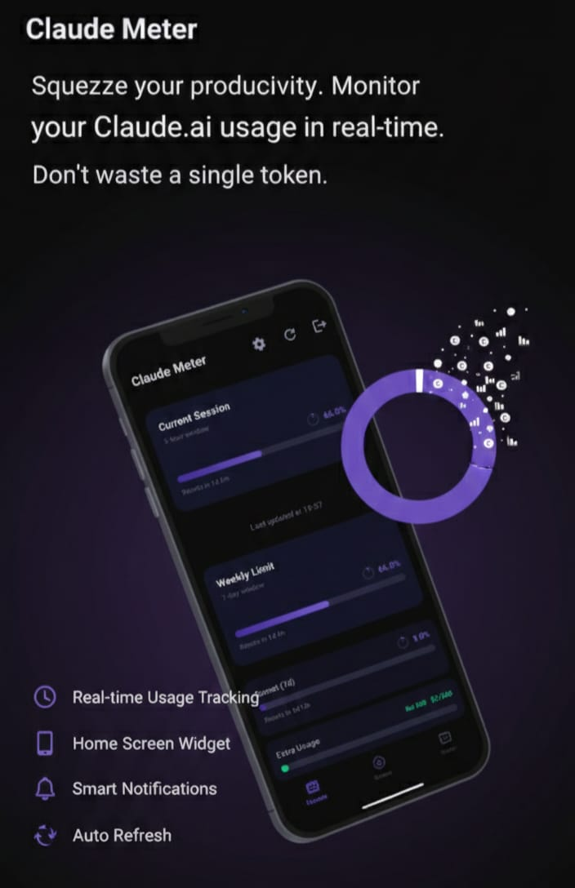
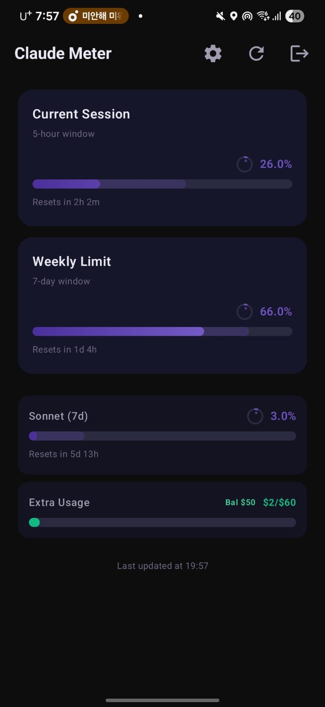
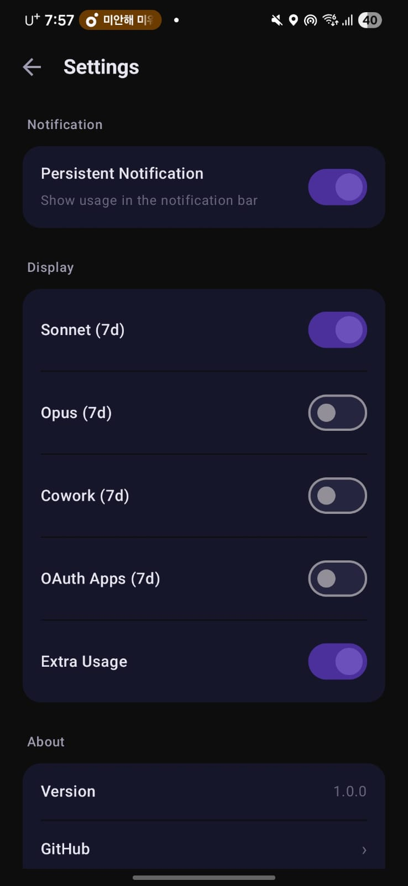
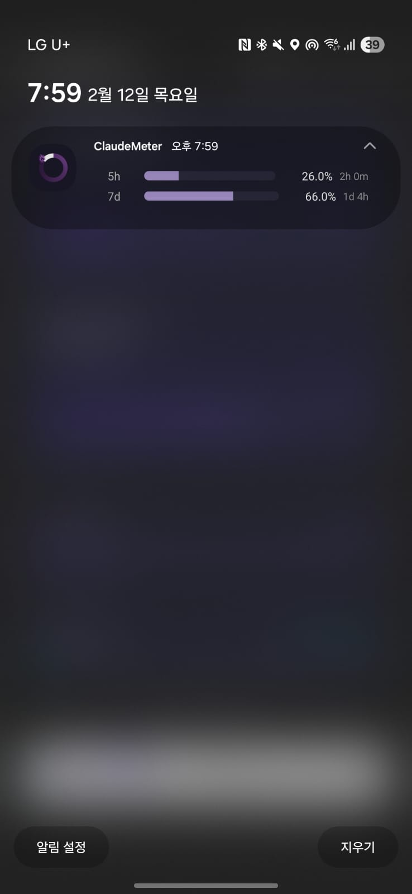

# ClaudeMeter

<p align="center">
  
</p>

**Don't Waste a Single Token**

<p align="center">
  &nbsp;&nbsp;
  &nbsp;&nbsp;
  
</p>

Squeeze your productivity. Monitor your Claude.ai usage in real-time.

## Features

- **Real-time Usage Tracking** - Monitor session and weekly usage limits at a glance
- **Home Screen Widget** - Check your usage without opening the app
- **Visual Progress Bars** - Clean, color-coded indicators (normal / warning / critical)
- **Background Updates** - Automatic refresh every 5 minutes via WorkManager
- **Push Notifications** - Get alerted when usage hits critical thresholds
- **Per-model Breakdown** - Track Sonnet, Opus, Cowork, and OAuth Apps usage separately
- **Overage & Prepaid Tracking** - Monitor extra usage spending and prepaid credits
- **Secure** - Credentials stored locally with Android EncryptedSharedPreferences

## Installation

### Download APK

1. Download the latest APK from [Releases](https://github.com/dion-jy/claude-meter/releases)
2. Enable "Install from unknown sources" if prompted
3. Install and launch ClaudeMeter

### Build from Source

**Prerequisites:**
- Android Studio (Hedgehog or later)
- JDK 17

```bash
git clone https://github.com/dion-jy/claude-meter.git
cd claude-meter/android
./gradlew assembleDebug
```

The APK will be at `app/build/outputs/apk/debug/`.

## Usage

1. **Launch ClaudeMeter**
2. **Login** - A WebView opens to claude.ai; sign in with your credentials
3. **View usage** - Your real-time metrics appear on the main screen
4. **Add widget** - Long-press your home screen and add the ClaudeMeter widget
5. **Configure** - Toggle which metrics to display in Settings

## Understanding the Display

### Usage Metrics

| Metric | Description |
|--------|-------------|
| Session (5h) | Current session utilization |
| Weekly (7d) | Rolling weekly usage |
| Sonnet 7d | Sonnet model weekly usage |
| Opus 7d | Opus model weekly usage |
| Cowork 7d | Cowork feature weekly usage |
| OAuth Apps 7d | OAuth apps weekly usage |
| Extra Usage | Overage spending |

### Color Coding

- **Normal** (0-74%) - Standard usage
- **Warning** (75-89%) - Approaching limit
- **Critical** (90-100%) - Near or at limit

## Privacy & Security

- All credentials stored **locally only** using EncryptedSharedPreferences
- No analytics, telemetry, or third-party SDKs
- The app communicates **only** with `claude.ai` official API endpoints
- See [PRIVACY_POLICY.md](PRIVACY_POLICY.md) for full details

## Tech Stack

- **Language:** Kotlin
- **UI:** Jetpack Compose + Material3
- **Widget:** Glance (Compose-based app widgets)
- **Networking:** OkHttp3
- **Background:** WorkManager
- **Min SDK:** 26 (Android 8.0)
- **Target SDK:** 34 (Android 14)

## Contributing

Contributions are welcome! 🎉

1. Fork the repository
2. Create your feature branch (`git checkout -b feat/amazing-feature`)
3. Commit your changes (`git commit -m 'Add amazing feature'`)
4. Push to the branch (`git push origin feat/amazing-feature`)
5. Open a Pull Request

> **Note:** Direct pushes to `main` are not allowed. All changes must go through a PR.

## License

MIT License - feel free to use and modify as needed.

## Disclaimer

This is an unofficial tool and is not affiliated with or endorsed by Anthropic. Use at your own discretion.

## Support

If you encounter issues:
1. Check the [Issues](https://github.com/dion-jy/claude-meter/issues) page
2. Create a new issue with details about your problem
3. Include your Android version and any error messages

## Acknowledgments

This project was originally inspired by [claude-usage-widget](https://github.com/SlavomirDurej/claude-usage-widget) by Slavomir Durej.

---

Made with care for the Claude.ai community
